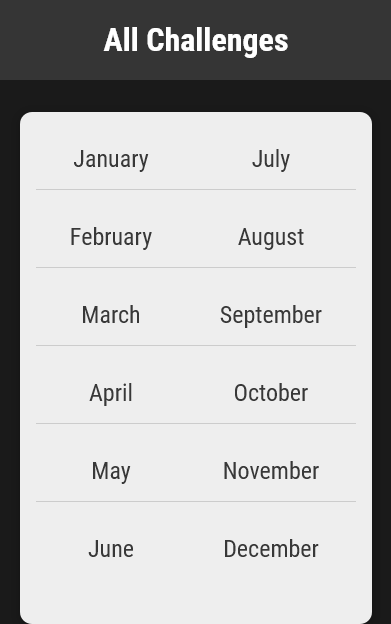
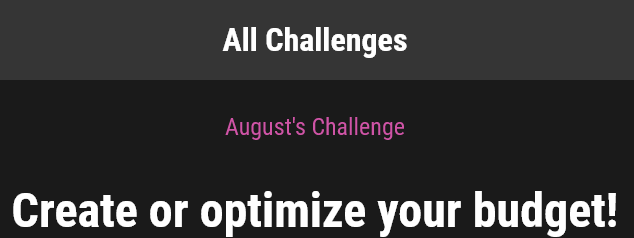

# What is this?
A monthly challenges website. All challenges and URLs are dynamically loaded from data. In the URL you can pass a number instead of a month name and it will convert it to a month and load the page. Invalid months will show a 404 page.

# Competencies demonstrated
URL routing, views, dynamic path segments, captured values, path converters, redirects, url name/reverse, templates, static files (css, javascript, images), DTL, filters, tags, and static files.

